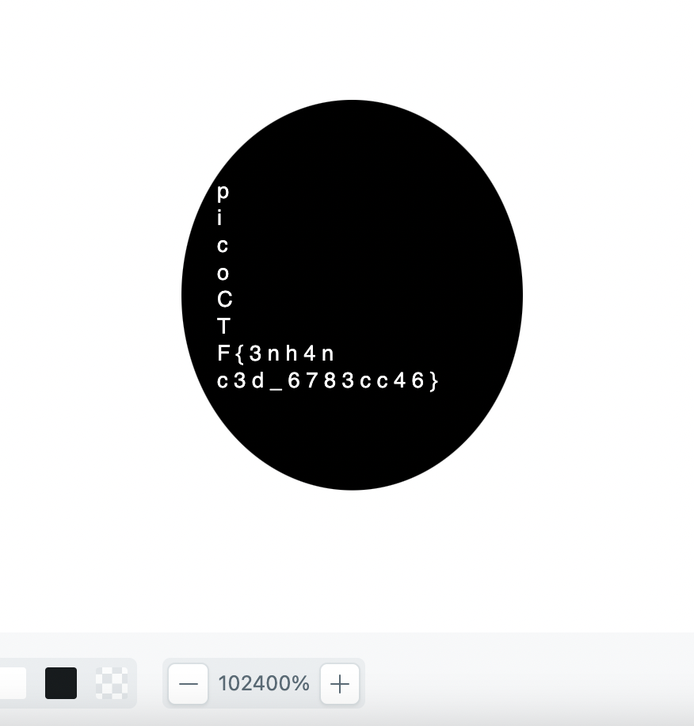

# enhance

The name `enhance` gives a good indication of how to solve this challenge. Opening the SVG using a basic in-house viewer shows a large black circle with a white center--no flag. I used [https://www.svgviewer.dev/](https://www.svgviewer.dev/) to open the .svg and zoom in a lot.

Only when viewing with a 102,400 times zoom can we see the flag.

Thus the flag is `picoCTF{3nh4nc3d_6783cc46`.
